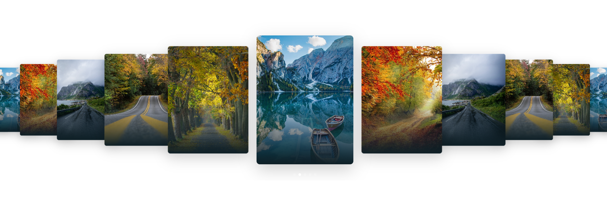

# Carousel-effect_coverflow ⭐⭐⭐⭐☆


<p align="center" style="color: white;">
    
</p>


<p>
    <a href="https://www.linkedin.com/in/juan-estaban-ar%C3%A9valo-056bab240/" target="_blank" rel="Linkedin">
      
    </a> 
    <a href="https://www.instagram.com/jeacsi.official_022?igsh=MWJ6MHRwcnhoZXVxbQ==" target="_blank" rel="Instagram">
      
    </a>
</p>
<p></p>

```bash
    git clone https://github.com/Juanes200122/Carousel-effect_coverflow.git
    cd Carousel-effect_coverflow
```
<div align="right">
    


</div>

## <b> Funcionalidad</b>
<p>Js libreria Swiper</p>
<div>
    
</div>

```JS
   var swiper = new Swiper(".swiper", {
    effect: "coverflow",
    grabCursor: true,
    centeredSlides: true,
    slidesPerView: "auto",
    coverflowEffect: {
        rotate: 0,
        stretch: 0,
        depth: 100,
        modifier: 2,
        slideShadows: true
    },
    keyboard: {
        enabled: true
    },
    mousewheel: {
        thresholdDelta: 70
    },
    spaceBetween: 60,
    loop: true,
    pagination: {
        el: ".swiper-pagination",
        clickable: true
    }
});


```


## <b> Skills</b>
  - 💻 &nbsp;
    
  - 🌐 &nbsp;
    
    
    


